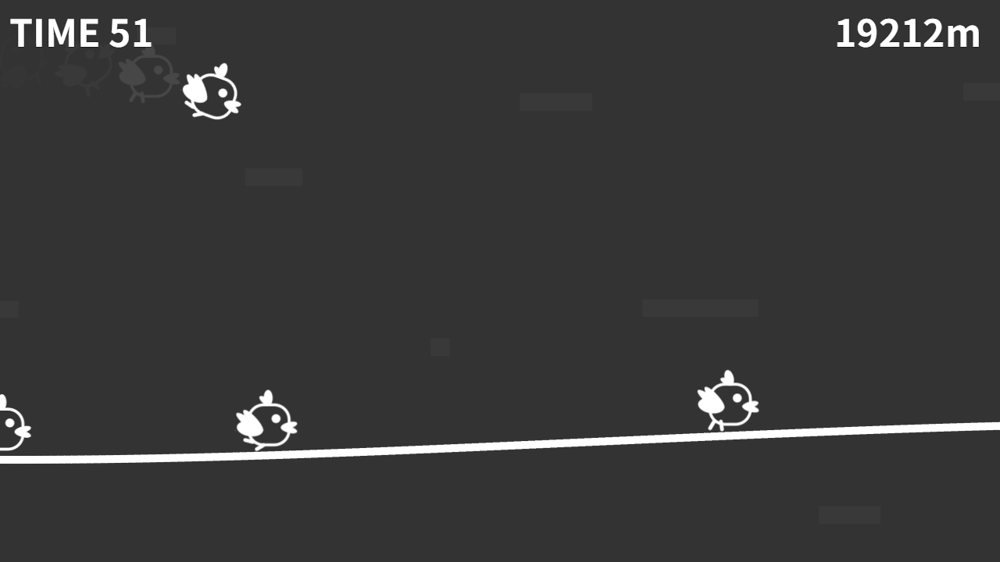

# コッコラン

## ゲーム紹介
より速く、より遠くへ...！  
ナカマを踏むと加速する！  
ソニック・ザ・コッコ！  

## 操作方法
#### ジャンプ  
  画面にタッチ
#### 滑空  
  ジャンプ中に長押し

## ゲーム詳細
ジャンプ中の連続踏みで少しだけ加速ボーナスがあります。  
走行中は地形が加減速に影響します。  
滑空中は加減速がありません。  
ニワトリなのでずっとは飛べません。  
  
このゲームは地形生成・ナカマコッコの挙動にプレイヤー全員が同じシードの乱数を使用しています。  
これは同じ放送内で異なるプレイヤーが同じ操作を続けた場合、最初から最後までまったく同じ結果になる、という意味です。  
つまりプレイの内容によっては、地形・コッコの挙動に変化が生じる可能性があります。  

## 備忘録
制作時間が極めて少なく、今後以下の問題に修正が入るかもしれないリスト(スピード感は残す方向で)。
- プレイヤーの動きやスクロール速度等のバランス調整
- カメラの調整、特に高速時のカメラ酔い、ぶれ、長い下り坂で滑空中のプレイヤーがカメラ外へはみ出る等 (地形を画角に収めることで修正)
- 致命的なバグが残っている可能性
- 旧式のモバイルデバイスでも正常に遊べるのかどうか
- 細々とした演出等（速度計を付けるなど）

## 更新履歴
#### 2025/04/27
- 公開
#### 2025/04/28
- 地形の生成を修正  
カメラを垂直方向に動かさなくても問題ないレベルまで起伏を小さくするように修正
- カメラの挙動を修正  
ゲーム中のカメラのY軸を固定
- その他、軽微な修正
#### 2025/04/29
- 未操作であればスコアの計上をしないように変更
- 不適当な乱数の使用箇所を修正
- その他、軽微な修正

## オープンソースライセンス
Akashic Engine  
https://akashic-games.github.io/  

## ライセンス
本リポジトリは MIT License の元で公開されています。 詳しくは [LICENSE](/LICENSE) をご覧ください。  
ただし音声ファイルは以下の素材を利用しています。詳しくは各ページをご覧ください。  

#### 効果音
[(C) 効果音工房](https://umipla.com/%E5%88%A9%E7%94%A8%E8%A6%8F%E7%B4%84)

#### BGM
[Funny! Funny!（MAKOOTO）](https://commons.nicovideo.jp/works/nc182381)
